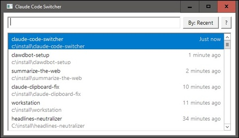
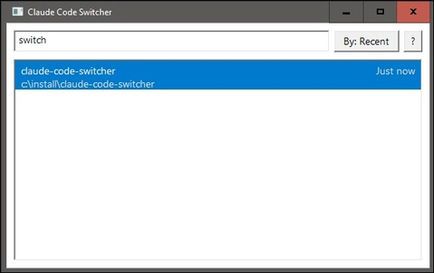

# Claude Code Switcher

A fast, native Windows utility for switching between Claude Code projects. Shows all your Claude Code projects in a popup dialog sorted by most recently used, with fuzzy search filtering.

> **Latest Version**: 0.3.1 | [See What's New](CHANGELOG.md)



## Features

- Native Win32 GUI for minimal startup time
- Fuzzy search to filter projects as you type
- Sort by recent use (default) or alphabetically by name
- Configurable terminal: Windows Terminal, WezTerm, cmd.exe, or custom command
- Keyboard-driven: fully usable without mouse
- Launcher-style behavior: closes automatically when losing focus
- DPI-aware: scales properly on high-DPI displays
- Optional update notifications via GitHub Releases

## Installation

### Winget

```bash
winget install Fanis.ClaudeCodeSwitcher
```

### Scoop

```bash
scoop bucket add fanis https://github.com/fanis/scoop-apps
scoop install claude-code-switcher
```

### Manual download

Download `claude-code-switcher.exe` from the [latest release](https://github.com/fanis/claude-code-switcher/releases/latest) and place it anywhere on your system.

## Terminal Configuration

By default, the switcher auto-detects your terminal (Windows Terminal, then WezTerm, then cmd.exe). You can change this in Settings (F1) or by editing `~/.claude-code-switcher/config.json`:

```json
{"terminal": "wezterm"}
```

Options: `""` (auto-detect), `"wt"`, `"wezterm"`, `"cmd"`, or a custom command with `{dir}` and `{claude}` placeholders.

The built-in WezTerm profile prefers `wezterm.exe` from your `PATH` and launches projects with `wezterm start --new-tab`, so it reuses an existing WezTerm window when possible and starts a new one otherwise.

## Requirements

- Windows 10/11
- Claude Code installed and used at least once

## Building

```bash
# Clone the repository
git clone https://github.com/fanis/claude-code-switcher.git
cd claude-code-switcher

# Build the executable
go build -o claude-code-switcher.exe -ldflags="-H windowsgui" .
```

The `-ldflags="-H windowsgui"` flag prevents a console window from appearing when launching the app.

## Usage

1. Run `claude-code-switcher.exe`
2. Type to filter projects by name
3. Use arrow keys to navigate the list
4. Press Enter to open the selected project in your configured terminal
5. Press Escape to close without selecting



## Keyboard Shortcuts

- `Up/Down Arrow`: Navigate project list
- `Enter`: Open selected project
- `Escape`: Close the switcher
- `Tab`: Toggle sort between recent/name
- `Ctrl+Backspace`: Delete word in search
- `F1`: Settings

## Integration with Hotkeys

For quick access, bind the executable to a global hotkey using:

- **AutoHotkey**: Create a script with `^!c::Run "path\to\claude-code-switcher.exe"`
- **PowerToys Keyboard Manager**: Map a shortcut to launch the exe

## Update Notifications

On first launch, you'll be asked whether you'd like to receive update notifications. If enabled, the app checks GitHub Releases for new versions in the background. When a new version is found, you'll be notified once on the next launch with an option to open the download page.

- Checks happen at most once per day
- Dismissed versions won't be shown again
- Toggle anytime in Settings (gear icon or F1)
- No auto-download or auto-install - you choose when to update

Settings are stored in `~/.claude-code-switcher/config.json`.

## How It Works

The switcher reads Claude Code's project data from `~/.claude/projects/` directory. Each project's last-used timestamp is extracted from `sessions-index.json` files.


## Provenance
This UserScript was authored by [Fanis Hatzidakis](https://github.com/fanis/claude-code-switcher) with assistance from large-language-model tooling (Claude Code).
All code was reviewed, tested, and adapted by Fanis.


## Licence

Copyright (c) 2026 Fanis Hatzidakis

Licensed under PolyForm Internal Use License 1.0.0

See LICENCE.md
